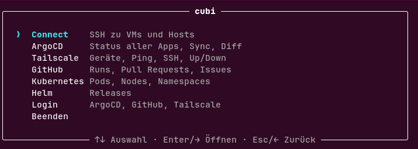
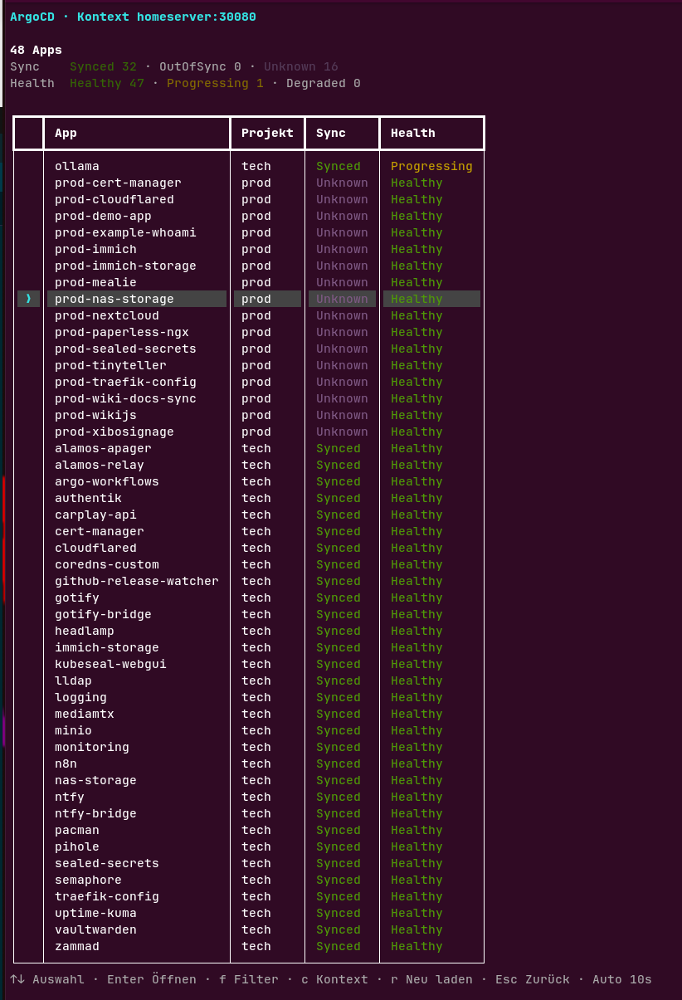

# cubi

Interactive terminal tool for everyday Kubernetes work. It bundles tools you already have installed into one menu that you navigate with the arrow keys.

```
cubi
```



## Sections

| Section | Contents |
| --- | --- |
| Connect | SSH to VMs and hosts, grouped as defined in the config |
| ArgoCD | Table of all apps with sync and health status, filters, sync, diff, refresh, link to the GitHub source |
| Tailscale | Device list with status, ping, SSH, up and down |
| GitHub | Workflow runs, pull requests, issues (incl. editing) and commits of a repo, plus the repo's project Kanban board |
| Kubernetes | Pods with logs and shell, nodes, warnings, switching namespace and context |
| Helm | Releases with status, values and history |
| Login | Login status for ArgoCD, GitHub and Tailscale, plus the matching login commands |

Every section can be opened directly, for example `cubi argocd` or `cubi login`.

The ArgoCD view lists all apps with sync and health status. Apps with problems are sorted to the top, and the table refreshes automatically.



## Usage

- Enter or the right arrow opens an entry.
- Esc or the left arrow goes back one level.
- In tables, `r` reloads. The footer shows the extra keys of the current section.

## Installation

```
./install.sh
```

The script checks for the Python modules `rich` and `pyyaml` and creates a symlink at `~/.local/bin/cubi`.

## Requirements

Python 3 with `rich` and `pyyaml`. Depending on the section you need `ssh`, `kubectl`, `argocd`, `tailscale`, `gh` and `helm`.

## Configuration

Hosts, ArgoCD contexts and GitHub repos live in `config/targets.yaml`. The file is looked up in this order:

1. The file named by the `CUBI_CONFIG` environment variable
2. `~/.config/cubi/targets.yaml`
3. `config/targets.yaml` in the repo

The GitHub Kanban board uses the project's "Status" field (or the first single-select field with columns). Pin a default board under `github.board`, otherwise cubi lets you pick one from `gh project list` for the repo's owner:

```yaml
github:
  board:
    owner: pkr-lab
    number: 3
```

Moving cards and editing issue labels/assignees needs a GitHub token with the `project` scope, which `gh auth refresh -s project,read:project` (also reachable from `cubi login` → GitHub → "Projekt-Scope aktivieren") adds on top of the default login.

## Notes

- `cubi` never handles passwords or tokens itself. Logins run through `argocd`, `gh` and `tailscale`.
- The ArgoCD status is read straight from the cluster with `kubectl`, so it works even when the ArgoCD server is unreachable.
